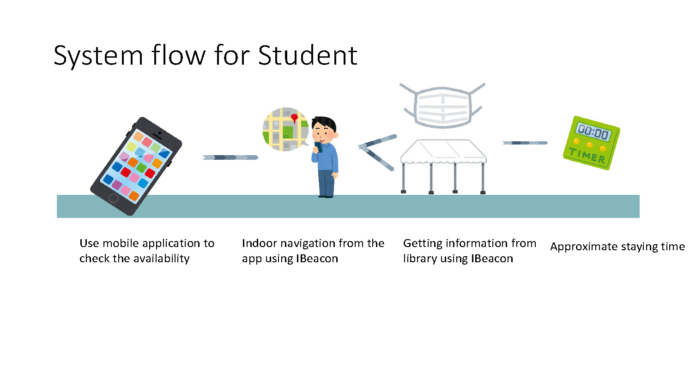
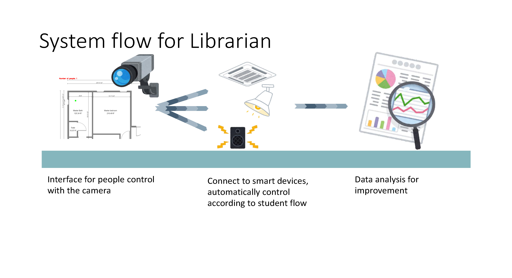
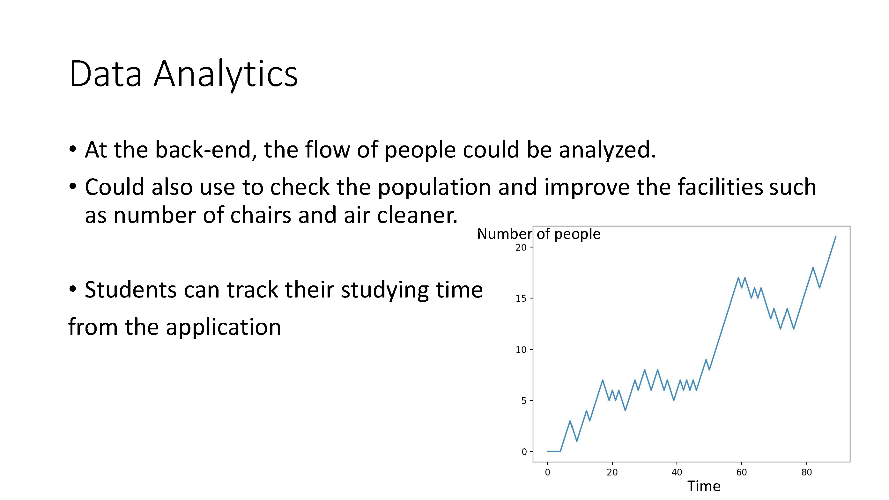

# Library-Seat-Availability-Checking-System
Assume the library is covered with Wi-Fi.
The camera using edge computing and connect to Wi-Fi to send processed data to the system and cloud.
The controller of camera using Wi-Fi to connect to those smart devices.
Students use mobile with the library app to find the IBeacon and no network setup is needed. It should be installed near to the door and without being covered.

